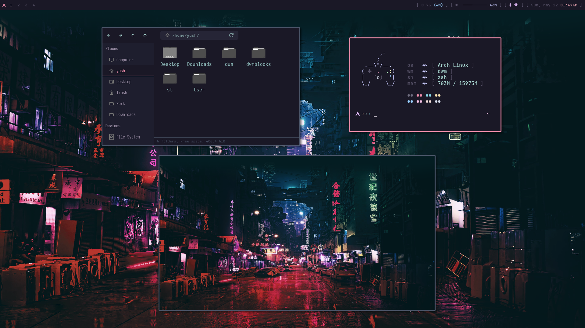

# Dotfiles

This repo contains configuration files for my Arch Linux/dwm setup.

It will mostly be used to fast track the setup process (with the help of installation scripts) whenever I do a fresh install of Arch.

## Details
- **WM:** dwm
- **OS:** Arch Linux
- **Terminal:** [ST](https://st.suckless.org/)
- **Editor:** Neovim w/ [nvchad config](https://nvchad.github.io/)
- **File Manager:** Thunar
- **Compositor:** [Picom](https://github.com/jonaburg/picom)
- **Color-scheme:** [Catppuccin](https://github.com/catppuccin/catppuccin)

### Fonts
- **JetBrainsMono Nerd Font** (for terminal, vim, and dwm/bar)
- **Iosevka** (for gtk applications)

Both are part of the [Nerd Fonts](https://www.nerdfonts.com/) package.

## Other
- My [dwm config](https://github.com/yuuushio/dwm)
- My [browser startpage](https://github.com/yuuushio/startpage.github.io)
- [Arch Install Guide/Notes]() - incorporates various installation scripts that install these config files, among other things.
- GTK theme is the [Nord gtk theme](https://github.com/EliverLara/Nordic) which I edited to integrate Catppuccin color-scheme.
- Pipewire and bluetooth conf are part of installation script so I don't have to manually edit them.

## Preview

## TODO
- Rofi rice
- Dmenu configs
- Dunst rice
- LightDM rice; though I might move to a more lightweight display manager in the near future.
